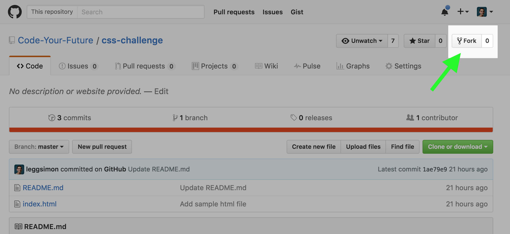

# Forking, Cloning & PRs

We Fork and Clone other peoples repositories so that we can work on them and try and improve them.

## Forking
Firstly Fork the base repository. This creates a mirror of the original repo within your own. You can do this by clicking the `Fork button` in the top right corner of the repo.

## Cloning

Now that you have a version of the base repo within your own, you can clone this onto your local machine to work on and create a Pull Request (PR) later on to merge your changes into the original.

[This guide](https://help.github.com/desktop/guides/contributing/cloning-a-repository-from-github-desktop/) from GitHub will show you how to do that. **Make sure you select where you are cloning the repo to on your machine!**

## Pull Requests

Pull Requests allow you to request for your changes to be brought into the base repo. You can read more about PRs [here](https://help.github.com/articles/about-pull-requests/)

Assuming all your local changes have been pushed up to GitHub you can follow [this guide](https://help.github.com/articles/creating-a-pull-request-from-a-fork/) which will show you how to create a PR from a forked repo.